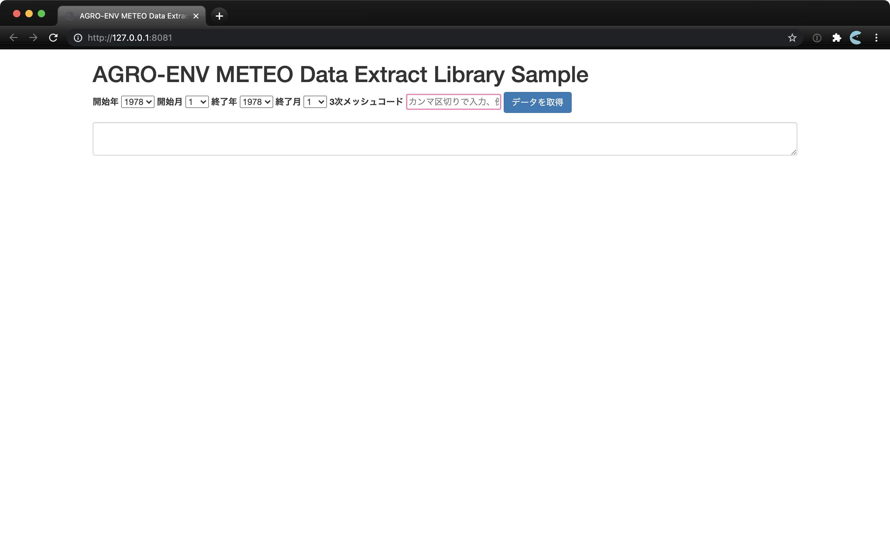

#  `@agro-env/meteo-search`

## 概要

`@agro-env/meteo-search` は、気象情報提供のための静的 API と連携して動作する検索及びフィルターするためのプログラムです。このリポジトリには、クライアントサイドで動作する抽出スクリプト、及び AWS 上で動作するサーバーレス構成の API が含まれています。

ソースコードは TypeScript で記述されています。 JavaScript にトランスパイルすることで、抽出スクリプトはブラウザの、またサーバーレス API は AWS Lambda 上の Node.js のランタイムで動作します。

## 前提

本ドキュメントに記載されたコマンドは、 PowerShell 上で動作させることを前提にしています。

## フォルダ構成

本プログラムを構成する主要なファイルは以下のフォルダに格納されています。これらの他には本ドキュメントやTypeScript のトランスパイルに関する設定ファイルなどが同一フォルダに格納されています。

```
.
├── dist  API サーバーのプログラム（*1）
├── docs  抽出スクリプト（*2）及びデモ環境の ウェブページ
└── src   プログラムのソースコード
```

*1 API サーバーのプログラムはトランスパイルによりソースコードから作成されます。トランスパイル済みのプログラムは Git で管理されていないため、トランスパイルをするまでこのフォルダは空になっています。

*2 抽出スクリプトもトランスパイルにより作成されますが、API サーバーのプログラムと違って、Git の管理下に加えてリポジトリに同梱しています。これは、抽出スクリプトとデモ環境を GitHub Pages を使ってホスティングしているためです。

## 環境設定

ローカル環境でのプログラムの開発及び AWS 環境へのデプロイの操作には Node.js (> 12) が必要です。以下のサイトからダウンロードすることができます。

https://nodejs.org/ja/

## 開発

### プログラムの取得

プログラムは以下の Git リポジトリからクローンすることができます。

```shell
$ git clone git@github.com:agro-env/meteo-search.git
```

### 依存プログラムのインストール

Node.js に同梱されたパッケージマネージャーの npm を使い、依存プログラムをインストールします。依存プログラムには、プログラム本体から利用される各種のユーティリティライブラリ、及び、TypeScript コンパイラなどの開発ツールが含まれています。

```shell
$ cd meteo-search
$ npm install
```

### テストの実行

以下のコマンドでソースコードに付随するユニットテストを実行します。

```shell
$ npm test
```

### プログラムのビルド

以下のコマンドで抽出スクリプトをトランスパイルします。ビルドしたプログラムは、 `docs/extract.js` として書き出されます。

```shell
$ npm run build:lib
```

また、以下のコマンドで API サーバーのソースコードをトランスパイルします。

```shell
$ npm run build
```

### ローカル環境での動作テスト

以下のコマンドで、抽出スクリプトの動作を確認するためのデモ画面を起動します。

```shell
$ npm run start:lib
```



また、以下のコマンドで、API サーバーをローカル環境で起動します。

```shell
$ npm run start
```

3000番ポートで API サーバーが起動し、 curl 等でアクセスすることができます。

```shell
$ curl "http://localhost:3000/dev/search?mtype=me&sy=2000&mcode=36225717&element=pr"
```

## デプロイ

### 抽出スクリプト

抽出スクリプトのデプロイは不要です。以下のように GitHub を CDN としてロードすることができます。

```html
<script src="https://agro-env.github.io/meteo-search/docs/extract.js"></script>
```

抽出スクリプトのソースコードを更新した際は、 GitHub にソースコードをプッシュする前にビルドを行ってください。

```shell
$ npm run build:lib
$ git add .
$ git commit -m"Update script"
$ git push origin master
```

### API サーバー

API サーバーを AWS 環境にデプロイするためには AWS の認証情報が必要です。AWS のコンソールから IAM を作成し、アクセスキーを取得した上で以下の環境変数を設定してください。

```shell
$ $env:AWS_ACCESS_KEY_ID = "xxxx"
$ $env:AWS_SECRET_ACCESS_KEY = "yyyy"
```

また、オプションとして、 GitHub の 静的 API サーバー以外のエンドポイントをデータの取得元として指定できます。その場合は以下の環境変数を指定してください。

```shell
$ $env:AGRO_ENV_STATIC_API_ENDPOINT = "https://example.com/%s/%s/%s/%s.json"
```

エンドポイントは、プレイスホルダー `%s` を4箇所含むフォーマット形式で指定します。これらは順に 年、1次メッシュコード、2次メッシュコード、3次メッシュコードに置換されます。

環境変数を設定した上で以下のコマンドを実行すると AWS 環境上に API サーバーが作成され、エンドポイントのURLが表示されます。
`dev` 及び `v1` の指定でそれぞれ別の API が作成されます。`dev` は開発環境としての、 `v1` は本番環境としての利用を想定しています。


```shell
$ npm run deploy:dev
$ npm run deploy:v1
```

また、以下のコマンドで作成したサーバーを削除することができます。

```shell
$ npm run remove:dev
$ npm run remove:v1
```

## ドキュメント

### 抽出スクリプト

抽出スクリプトをロードすると、ブラウザの `window` のスコープに `queryAgroEnvData` という関数が作成されます。
`queryAgroEnvData` は以下のオプションを引数として設定でき、またオブジェクト型のデータの配列を非同期で取得します。

```typescript
type Option = {
  startYear: number; // 開始年
  endYear?: number; // 終了年
  startYear?: number; // 開始月
  endMonth?: number; // 終了月
  gridcodes: string[]; // 3次メッシュコードの配列
  endpointFormat?: string; // エンドポイントのフォーマット。デフォルトでは GitHub Pages での静的配信 API を指定
}

type AgroEnvData = {
  gridcode: string; // 3次メッシュコード
  year: number;
  month: number;
  day: number;
  tm: number;
  pr: number;
  tn: number;
  sr: number;
  tx: number;
  sd: number;
}

type QueryAgroEnvData = (option: Option) => Promise<AgroEnvData[]>

declare global {
  interface Window {
    queryAgroEnvData: QueryAgroEnvData;
  }
}
```

### 使用例

抽出スクリプトは以下のように利用できます。この例では、2005年2月から2007年10月の期間において、36225717及び36225718の3次メッシュのデータを取得します。

```html
<script src="https://agro-env.github.io/meteo-search/docs/extract.js"></script>
<script>
  const option = {
    startYear: 2005,
    startMonth: 2,
    endYear: 2007,
    endMonth: 10,
    gridcodes: ['36225717', '36225718'],
    endpointFormat: 'https://example.com/%s/%s/%s/%s.json'
  }

  window.queryAgroEnvData(option)
    .then(data => {
      cosnole.log(data)
    })
</script>
```
